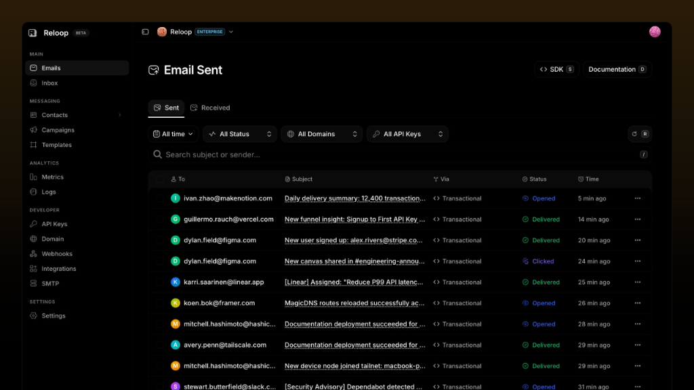

# Reloop

**Open-source transactional email for developers.** Send with a REST API or SMTP, receive inbound mail, and run the whole platform on your own servers.

A self-hostable alternative to [Resend](https://reloop.sh/compare/resend), SendGrid, and Postmark.


[Website](https://reloop.sh) · [Documentation](https://reloop.sh/docs) · [Self-host](https://reloop.sh/docs/self-host/vps) · [Reloop Cloud](https://reloop.sh/dashboard/signup) · [Discord](https://discord.gg/ZBYwWKY96U)

  





---


## Start here


| I want to...          | Do this                                                                                                                           |
| --------------------- | --------------------------------------------------------------------------------------------------------------------------------- |
| Try Reloop            | [Create a Reloop Cloud account](https://reloop.sh/dashboard/signup). The Free plan includes 3,000 emails a month and 100 a day.   |
| Send an email         | Use the [API example](#send-an-email) below, then the [send API reference](https://reloop.sh/docs/api/mail/post-api-mail-v1send). |
| Self-host             | Run the [VPS installer](#self-host) on Ubuntu or Debian. [Read the script first](https://reloop.sh/docs/self-host/vps).           |
| Understand the system | Read [Architecture](#architecture) and the [docs](https://reloop.sh/docs).                                                        |
| Contribute            | Follow [CONTRIBUTING.md](CONTRIBUTING.md). Local setup is `bun setup` then `bun dev`.                                             |


Personal and internal self-hosting is allowed under the Apache License 2.0 plus extra Reloop Labs terms. Offering Reloop as your own hosted service is not. Details are in [License](#license).

---


## What you can do

Reloop is one email platform: a transactional API, an SMTP relay, campaigns, and an inbound inbox. Reloop Cloud and a self-hosted install run the same product. Reloop is not a drop-in Resend proxy. Plan a small client change if you are migrating.

**Send**

- Transactional email over `POST /api/mail/v1/send` with an `x-api-key` header
- SMTP submission on ports 465 and 587
- Sending domains with SPF, DKIM, and DMARC records generated in the dashboard

**Receive**

- Inbound mail on your domain (MX to the Reloop server, port 25)
- Agent inbox for reading and working with received mail

**Operate**

- Visual and code templates
- Broadcast campaigns, contacts, lists, and suppression
- Webhooks for delivery events
- Opens, clicks, bounces, and delivery logs stored in PostgreSQL
- Multi-step workflows (beta)

---


## Send an email

Create an API key in the dashboard, verify a sending domain, then:

```bash
curl -X POST https://reloop.sh/api/mail/v1/send \
  -H "x-api-key: rl_your_api_key" \
  -H "Content-Type: application/json" \
  -d '{
    "from": "Reloop <hello@mail.example.com>",
    "to": "user@example.com",
    "subject": "Welcome to Reloop",
    "html": "<p>Thanks for signing up.</p>",
    "text": "Thanks for signing up."
  }'
```

Node.js, with the published [`reloop-email`](https://www.npmjs.com/package/reloop-email) package:

```bash
npm install reloop-email
```

```ts
import { Reloop } from "reloop-email";

const reloop = new Reloop({ apiKey: process.env.RELOOP_API_KEY });

await reloop.mail.send({
  from: "Reloop <hello@mail.example.com>",
  to: "user@example.com",
  subject: "Welcome to Reloop",
  html: "<p>Thanks for signing up.</p>",
  text: "Thanks for signing up.",
});
```

SDKs are also published for Python, Go, PHP, Ruby, Rust, Java, Elixir, and .NET. See the [SDK list](https://reloop.sh/docs/resources/sdks) and the [framework examples](https://reloop.sh/docs/introduction).

On a self-hosted install, send to your own API host instead of `https://reloop.sh`.

---


## Self-host

The supported production install is one command on a fresh server. It installs Docker, writes the Compose stack, generates secrets, applies the database schema, starts the services, checks health, and prints the DNS records to add.

```bash
curl -fsSL https://reloop.sh/install.sh -o install.sh
less install.sh
sudo bash install.sh
```


|               |                                                                                                                                                                    |
| ------------- | ------------------------------------------------------------------------------------------------------------------------------------------------------------------ |
| OS            | Ubuntu 22.04, Ubuntu 24.04, Debian 12, or Debian 13 (x86_64)                                                                                                       |
| Size          | 2 vCPU and 4 GB RAM minimum. 4 vCPU, 8 GB RAM, and 50 GB disk is the comfortable size. The installer stops below 35 GB of disk because the images are about 22 GB. |
| Ports         | 80 and 443 for the dashboard and API. Outbound 25 so Reloop can deliver mail. Inbound 25 to receive mail. 465 and 587 for clients submitting to Reloop.             |
| After install | `reloop status`, `reloop logs`, `reloop restart`, `reloop update`                                                                                                  |


Full walkthrough: **[Deploy on a VPS](https://reloop.sh/docs/self-host/vps)**.

A self-hosted install leaves out the pieces that only belong to Reloop Cloud: public docs on that host, credits and quotas, the public validation tools, and the operator console. Sending is not metered.

A Coolify template is ready: [Deploy on Coolify](https://reloop.sh/docs/self-host/coolify). Kubernetes, Dokploy, Railway, and the other one-click targets are not ready yet.

---


## Reloop Cloud

Reloop Labs runs the same codebase as a hosted service.

- [Sign up](https://reloop.sh/dashboard/signup)
- Free: 3,000 emails a month, 100 a day
- Paid plans and overage are on the [pricing page](https://reloop.sh/pricing)

Self-hosting has no Reloop license fee. You still pay for the server, DNS, and any IP or blocklist work your mail volume needs.

---


## Architecture

Reloop is a Bun and Turborepo monorepo.

- **Frontends:** marketing site, dashboard, docs, link tracking, and an operator console
- **API services:** auth, domains, API keys, mail, templates, campaigns, contacts, webhooks, logs, inbox, workflows, uploads, and related services, written with Elysia
- **Mail transport:** [KumoMTA](https://github.com/KumoCorp/kumomta) for submission and delivery. Reloop does not sit on Amazon SES.
- **Data:** PostgreSQL (Drizzle), Redis, BullMQ for jobs, NATS for events
- **Edge:** Caddy for TLS and routing. Object storage is S3-compatible and optional on a self-hosted install.
- **Local development:** Docker Compose also runs Mailpit so local sends stay on your machine

Developer setup, ports, and per-service notes: [Setup guide](https://reloop.sh/docs/setup).

---


## Documentation


|                                                                    |                                      |
| ------------------------------------------------------------------ | ------------------------------------ |
| [Introduction](https://reloop.sh/docs/introduction)                | Send your first transactional email  |
| [API reference](https://reloop.sh/docs/api)                        | HTTP API                             |
| [SDKs](https://reloop.sh/docs/resources/sdks)                      | Official client libraries            |
| [Webhooks](https://reloop.sh/docs/webhooks)                        | Delivery events                      |
| [Self-host on a VPS](https://reloop.sh/docs/self-host/vps)         | Production installer                 |
| [Local setup](https://reloop.sh/docs/setup)                        | Contribute from a checkout           |
| [Compare with Resend](https://reloop.sh/compare/resend)            | What changes if you move             |
| [Changelog](https://reloop.sh/changelog)                           | What shipped                         |


---


## Contributing

Bug reports, docs fixes, and code contributions are welcome. Read [CONTRIBUTING.md](CONTRIBUTING.md) and the [Code of Conduct](CODE_OF_CONDUCT.md) first.

Local development needs Bun 1.3 or newer, Docker, and mkcert:

```bash
git clone https://github.com/reloop-labs/reloop.git
cd reloop
bun setup
bun dev
```

`bun setup` checks those tools, trusts local TLS certificates, installs dependencies, copies env files, starts Postgres and the rest of the Compose stack, and pushes the database schema. The app is served at `https://local.reloop.sh`. The full sequence is in the [setup guide](https://reloop.sh/docs/setup).

---


## Security

Report vulnerabilities in private. Do not open a public issue.

- [GitHub private advisory](https://github.com/reloop-labs/reloop/security/advisories/new)
- Email `reloop.sh@gmail.com` with the subject `[SECURITY]`

The process, response window, and supported versions are in [SECURITY.md](SECURITY.md).

---


## Community

- [Discord](https://discord.gg/ZBYwWKY96U)
- [X](https://x.com/reloop_labs)
- [LinkedIn](https://www.linkedin.com/company/reloop-labs)
- [GitHub issues](https://github.com/reloop-labs/reloop/issues)
- [Support](https://reloop.sh/support)
- [Changelog](CHANGELOG.md)

---


## License

Reloop is licensed under the [Apache License 2.0](https://www.apache.org/licenses/LICENSE-2.0) with additional use restrictions from Reloop Labs. Read [LICENSE](LICENSE) before you redistribute it or run it for other people.

You may use, copy, modify, and run Reloop for personal use and for internal company use, including a private self-hosted install.

You may not sell or sublicense it, offer it as a hosted service, or build a product whose primary purpose is to compete with Reloop Labs. There is no commercial license for third parties to resell Reloop or to operate a competing hosted email service on this code.

Questions: `reloop.sh@gmail.com`. The same terms are summarized at [reloop.sh/license](https://reloop.sh/license).

---


Reloop is in the [Vercel Open Source Program](https://vercel.com/oss).

Built by [Reloop Labs](https://reloop.sh).

